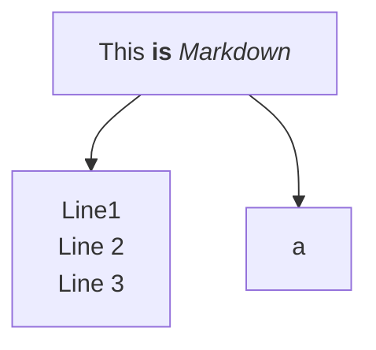

# Social Media Clipper System
* User Must Login with thier creds
* Get chrome plugins
* Features
    * A floating widget in right top
    * with 2 tabs, usage tab and logging/debuggin tab
    * Option to select folder where captured post CSVs are written to
    * New CSV per Day/Run with session start timestamp in file name
    * Dont recopy existing post to csv
    * Get Image, PDF, Video and Text (create a file in the same /media and link the name to the CSV as an entry)
    * a color status indicator
    * Pause and Resume feature
    * Debugger, to get DOM/strcuture details incase the parsing failed
    * report if parsing fails in debug tab
    * what we have currenlyt is good

* Issues with Linkedin
    * The status is green and I set folder but parsing doesnt happen
    * even if I refresh, it works after a few tries

